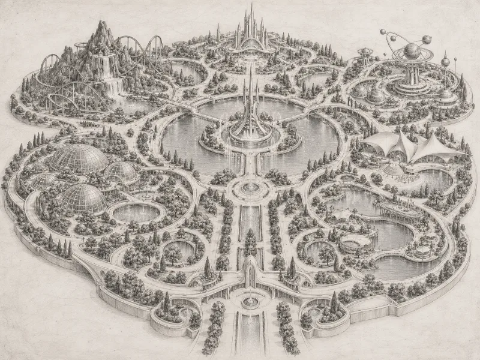
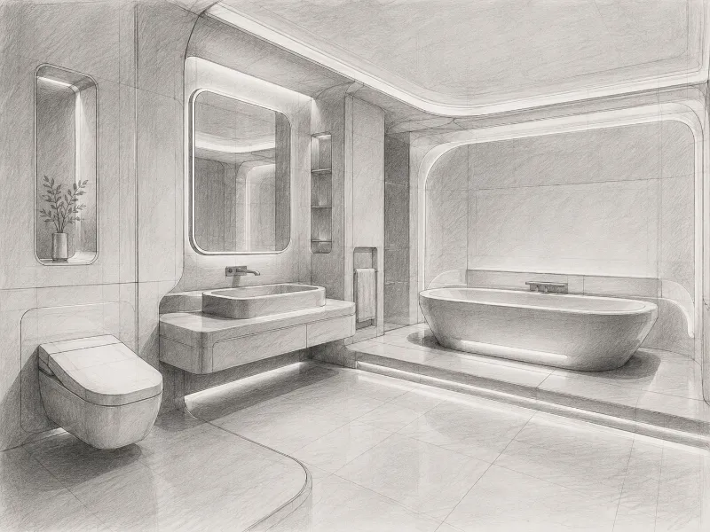

<div align="center">

  <h1>GenAIArt</h1>

  <h3>Speculative Design&nbsp;·&nbsp;Generative AI Art&nbsp;·&nbsp;Creative Archives</h3>

  <p>
    A visual archive of imagined environments for future urban life,<br />
    supported by a Python tool that connects each concept with its prompt and images.
  </p>

  <p>
    <a href="#overview"><strong>Overview</strong></a>
    &nbsp;·&nbsp;
    <a href="#selected-concepts"><strong>Concepts</strong></a>
    &nbsp;·&nbsp;
    <a href="#how-it-works"><strong>How It Works</strong></a>
    &nbsp;·&nbsp;
    <a href="#running-locally"><strong>Run Locally</strong></a>
    &nbsp;·&nbsp;
    <a href="#current-data-model"><strong>Data Model</strong></a>
    &nbsp;·&nbsp;
    <a href="#project-architecture"><strong>Architecture</strong></a>
  </p>

</div>

<br />

## Overview

**GenAIArt** explores generative AI as a medium for speculative design and visual invention. Its creative focus is future urban life: imagining environments, architectural systems, and objects through the relationship between human needs, geometric order, and visual expression.

The repository brings together two complementary layers: a collection of AI-generated concept images with their written prompts, and a lightweight Python application that turns the collection into a structured JSON catalog. The refactored code separates configuration, scanning, identification, and storage so that the archive can grow without changing the catalog-building workflow.

**The Python application catalogs existing artwork; it does not generate images or call an AI service.** Image generation takes place outside the application. The works are speculative visual studies, not validated architectural or engineering proposals.

<br />

<div align="center">

| Project Type | Creative Focus | Runtime | Catalog | License |
| :---: | :---: | :---: | :---: | :---: |
| Visual archive & catalog builder | Future urban life | Python 3.10+ | JSON | Apache-2.0 |

</div>

<br />

## Selected Concepts

The current collection contains two concepts, each with a shared prompt and four image variations. Both explore a pencil-and-graphite visual language through AI-generated imagery; the drawing aesthetic does not imply physical hand-drawn originals.

<table>
  <tr>
    <td width="50%" align="center" valign="top">
      <a href="./assets/Futuristic-Amusement-Park/images/Image01.webp">
        
      </a>
      <h3>01 | Futuristic Amusement Park</h3>
      <p><strong>Collective Leisure · Nature · Spatial Harmony</strong></p>
      <p>A speculative environment exploring how play, geometric order, and integrated nature might support joy and human connection.</p>
      <p><a href="./assets/Futuristic-Amusement-Park/images">View variations</a>&nbsp;·&nbsp;<a href="./assets/Futuristic-Amusement-Park/prompt.txt">Read prompt</a></p>
    </td>
    <td width="50%" align="center" valign="top">
      <a href="./assets/Futuristic-Bathroom/images/Image01.webp">
        
      </a>
      <h3>02 | Futuristic Bathroom</h3>
      <p><strong>Personal Care · Comfort · Geometric Clarity</strong></p>
      <p>A speculative interior exploring hygiene, dignity, and emotional calm through an integrated, restrained architectural language.</p>
      <p><a href="./assets/Futuristic-Bathroom/images">View variations</a>&nbsp;·&nbsp;<a href="./assets/Futuristic-Bathroom/prompt.txt">Read prompt</a></p>
    </td>
  </tr>
</table>

<br />

## Creative Approach

The prompts connect functional intentions with visual direction: what a space could offer people, how its elements relate, and how the composition should feel. They describe spatial hierarchy, geometry, materials, perspective, lighting, and constraints, rather than relying only on a subject and style label.

Keeping each prompt alongside its image variations preserves the relationship between the written intention and the visual outcomes. The archive is a place to revisit those relationships and develop new ideas about future environments.

<br />

## How It Works

| Stage | Current component | Responsibility |
| :--- | :--- | :--- |
| 01 · Configure | `CatalogConfig` | Defines the assets directory and the output path, `assets/artworks.json`. |
| 02 · Scan | `scan_collection()` | Visits immediate, non-hidden idea directories in filename order. |
| 03 · Read & validate | `read_artwork()` | Reads a non-empty prompt and collects supported image paths from each idea. |
| 04 · Identify | `image_id()` | Generates a deterministic UUID5 for each assets-relative image path. |
| 05 · Save | `save_catalog()` | Serializes the records to a temporary JSON file, then atomically replaces the catalog. |
| 06 · Report | `build_catalog()` / `BuildResult` | Coordinates the workflow and returns the output path and idea/image counts. |

The complete collection is scanned before storage begins. Missing prompts, invalid idea folders, or collections without supported images stop the build before an existing catalog is replaced.

<br />

## Collection Structure

Each immediate, non-hidden directory inside `assets/` is treated as an idea. The directory name becomes the catalog title.

| Path relative to the repository | Purpose |
| :--- | :--- |
| `assets/Futuristic-Amusement-Park/prompt.txt` | Shared prompt for the amusement park concept. |
| `assets/Futuristic-Amusement-Park/images/` | Image variations for that concept. |
| `assets/Futuristic-Bathroom/prompt.txt` | Shared prompt for the bathroom concept. |
| `assets/Futuristic-Bathroom/images/` | Image variations for that concept. |
| `assets/artworks.json` | Generated catalog; rebuilt from the idea folders. |

### Adding a concept

1. Create a new idea directory inside `assets/`, such as `Futuristic-Library`.
2. Add a non-empty UTF-8 `prompt.txt` containing the shared prompt.
3. Create an `images/` directory inside it and add at least one supported image.
4. Run `main.py` to rebuild the catalog.

Supported extensions are `.png`, `.jpg`, `.jpeg`, `.webp`, and `.gif`, matched without regard to case. Images are scanned directly inside `images/`; nested image directories are not traversed.

The scanner checks file extensions, not image contents. Symbolic links encountered in the collection are rejected, and unrelated non-hidden directories should not be placed directly inside `assets/` because they will be interpreted as ideas.

<br />

## Running Locally

GenAIArt requires **Python 3.10 or newer** and uses only the Python standard library. No third-party packages or AI API credentials are required to build the catalog.

### Open and run in your IDE

Download the repository or clone it:

```bash
git clone https://github.com/3ConstArt3/GenAIArt.git
cd GenAIArt
```

Open the project in your IDE, select a compatible Python interpreter, and run the root-level **`main.py`**. No command-line arguments or source-root adjustments are required for this entry point.

The assets path is resolved relative to `main.py`, so the entry point does not depend on the IDE's working directory.

### Optional terminal execution

```bash
python main.py
```

Use `python3 main.py` if your environment exposes Python through `python3`.

With the current two-concept, eight-image collection, a successful run prints a summary in this form; the final path depends on your computer:

```text
Saved 2 ideas and 8 images to /path/to/GenAIArt/assets/artworks.json
```

**A successful build replaces `assets/artworks.json`.** Edit the source prompts and image folders rather than the generated catalog. Removed images or ideas disappear from the catalog on the next successful build. Source prompts and image files are not modified.

<br />

## Programmatic Use

The catalog-building workflow can also be called directly from a script at the repository root:

```python
from pathlib import Path

from src.config import CatalogConfig
from src.service import build_catalog


config = CatalogConfig(
    assets_directory=Path(__file__).resolve().parent / "assets",
)
result = build_catalog(config)

print(result.artwork_count)
print(result.image_count)
print(result.output_file)
```

`BuildResult` is a frozen data class. Callers can catch `GenAIArtError` from `src.exceptions` to handle both invalid collections and catalog read/write failures through a shared error type.

<br />

## Current Data Model

`assets/artworks.json` contains a JSON array with one record per idea. The following excerpt preserves the current schema and one real image identifier; the prompt and image list are shortened for readability.

```json
[
  {
    "title": "Futuristic-Amusement-Park",
    "prompt": "Create a highly detailed, realistic hand-drawn conceptual illustration of a futuristic amusement park...",
    "images": {
      "450ebaca-7249-5319-b501-778e114cdf5d": "Futuristic-Amusement-Park/images/Image01.webp"
    }
  }
]
```

| Field | Meaning |
| :--- | :--- |
| `title` | Idea directory name, preserved as written. |
| `prompt` | Text read from `prompt.txt` using `utf-8-sig`, supporting UTF-8 with or without a BOM. |
| `images` | Mapping of deterministic image IDs to paths relative to `assets/`. |

Image identifiers are derived from paths, not image contents:

```python
uuid5(NAMESPACE_URL, "genaiart:image:" + relative_path)
```

Rebuilding or moving the entire collection preserves the IDs when its internal relative paths stay unchanged. Renaming an image or its idea directory changes the ID; replacing image contents at the same path does not. These IDs are not content hashes or integrity checks.

<br />

## Project Architecture

| File | Responsibility |
| :--- | :--- |
| `main.py` | IDE-friendly entry point, project-relative configuration, and console reporting. |
| `src/config.py` | `CatalogConfig` and supported image extensions. |
| `src/models.py` | `Artwork` records and the immutable `BuildResult` summary. |
| `src/scanner.py` | Collection traversal, prompt reading, validation, and image discovery. |
| `src/identifiers.py` | Path-based UUID5 generation. |
| `src/storage.py` | JSON serialization, temporary-file cleanup, and atomic replacement. |
| `src/service.py` | Reusable `build_catalog()` workflow. |
| `src/exceptions.py` | Shared, validation, and build error types. |
| `tests/test_catalog.py` | Temporary-directory tests for catalog behavior. |
| `assets/` | Source prompts, concept images, and the generated catalog. |
| `creations.jsonl` | Separate existing dataset; not read or updated by the current builder. |

<br />

## Design Decisions

- **Filesystem as the source of truth:** each idea keeps its prompt and images together in a readable folder structure.
- **Repeatable output:** sorted traversal and path-based identifiers keep repeated builds consistent for unchanged input.
- **Portable references:** catalog image paths use forward slashes and remain relative to the assets directory.
- **Validation before replacement:** the collection must pass scanning before the existing catalog is replaced.
- **Separated responsibilities:** scanning, domain records, identification, storage, and orchestration remain independent modules.
- **A small runtime footprint:** the builder uses standard-library Python and runs directly from the IDE.

<br />

## Tests

Run `tests/test_catalog.py` directly in your IDE, or execute the suite from the repository root:

```bash
python -m unittest discover -s tests -v
```

The tests use temporary directories rather than modifying the artwork collection. They cover catalog structure, prompt handling, deterministic rebuilds, validation, and intended storage/entry-point behavior.

<details>
<summary><strong>Current test-suite caveat</strong></summary>

<br />

At the time of this README update, four tests pass and two error because they still reference the previous `genaiart` directory name. The current application modules live in `src/`.

The stale references are `genaiart.storage.os.replace` in the mocked-write test and `PROJECT / 'genaiart'` / `project / 'genaiart'` in the entry-point test. These references need to target `src` before the complete suite can validate the refactored layout. This README does not claim that all tests pass.

</details>

<br />

## Possible Next Steps

A browsable gallery, per-image prompt histories, and richer concept metadata could build on the current catalog. These are possible extensions, not implemented features. The current application focuses on organizing existing prompts and images into a predictable, reusable data format.

<br />

## Contributing

Suggestions, catalog improvements, and clearly documented extensions are welcome. Open an issue or submit a pull request explaining the change and its purpose. Keep generated-image provenance clear and distinguish creative concepts from implemented software features.

<br />

## License

See the repository's [Apache License 2.0](./LICENSE).

<br />

<div align="center">

  <p><em>Designed and developed by <a href="https://github.com/3ConstArt3"><strong>ConstArt</strong></a></em></p>
  <br />

</div>